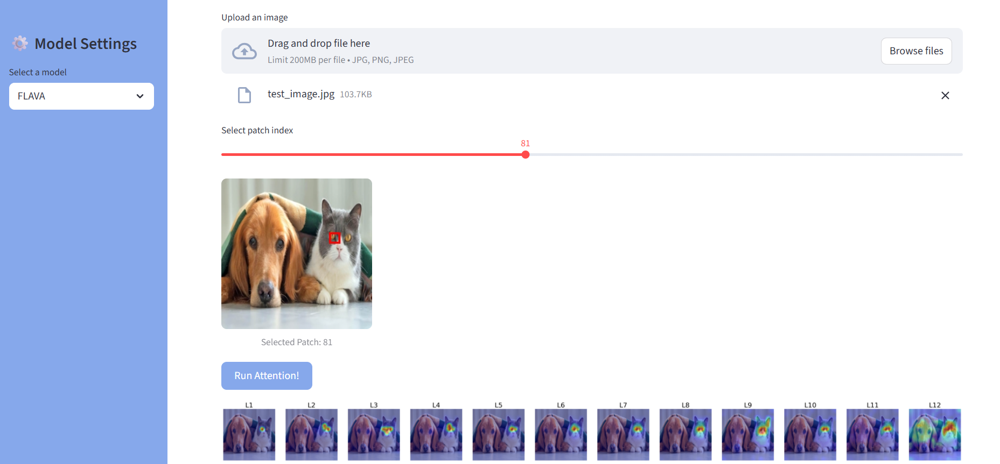
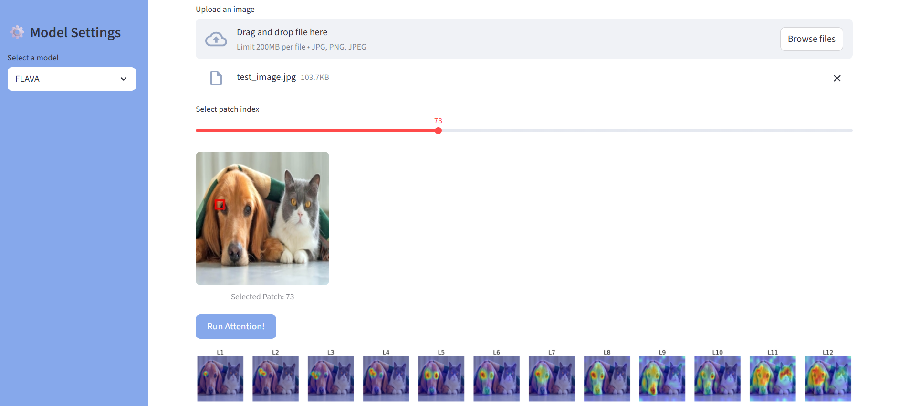

### Attention Map Explorer
The attention mechanism allows models to weigh the importance of different parts of an input—whether those are image patches or text tokens.

This application focuses on understanding of the **Self-Attention** within Image as well as the **Multimodal Cross-Attention**. You can **upload an image**, **select a patch** and see which other patches it's most focused on across different layers of the model.

### ⚙️ How it Works:

The function, `get_token_to_all_attn`, processes the model's attention outputs to generate a visual representation. It performs the following steps:

1.  **Averages Attention Heads**: It takes the raw attention tensors from the model and averages them across all attention heads for each layer. This creates a single attention matrix of shape `[seq_len, seq_len]`.
2.  **Isolates a Single Token's Attention**: It then selects the attention scores for a specific token (the image patch that the user chooses) and discards the scores for the first `[CLS]` token.
3.  **Reshapes into a Grid**: The one-dimensional attention scores for the selected token are reshaped into a two-dimensional grid that matches the spatial layout of the image patches.
4.  **Generates and Renders the Plot**: The resulting attention map is overlaid on the original image, with a higher intensity of color indicating a stronger attention score. 

### Future Work:

This project is a starting point for further exploration into model interpretability. The project currently supports **FLAVA** model but it will incorporate more recent and powerful models like **CLIP**, **LLaVA**, **Florence-2** to compare their attention patterns.It will also **Expand Functionality** by integrating more interpretability techniques beyond attention maps, such as **saliency maps**.

